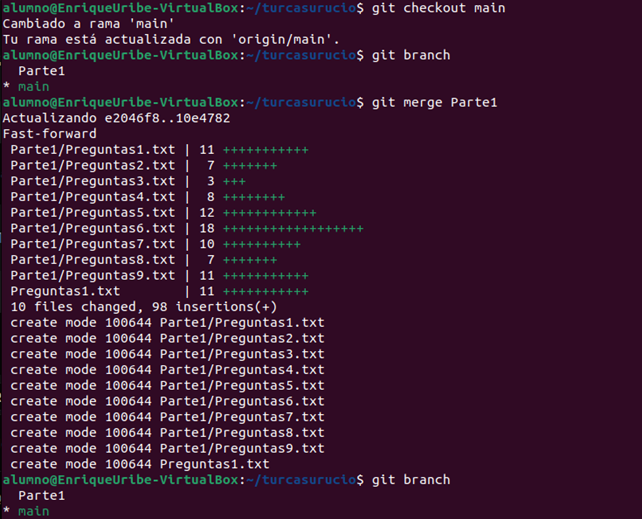
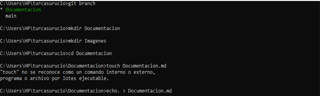

# Trabajo de Entornos

## Parte 1

- Hago git clone en el trabajo principal y creo una rama para hacer la parte 1, y de ahi me muevo con git checkout
  
    
- Respondemos la primera pregunta como prueba para ver como va todo esto del git y le hacemos un push pero que solo se modifique la rama “Parte1”, y asi se hara con cada pregunta
  
  
  
    

- Respondemos las preguntas del 2 al 4 y realizamos un commit de todo lo hecho para guardar el proceso
  
    

- Tras responder todas las preguntas hacemos el commit final de la Parte1, y finalizamos con un push
  
    

- Como la parte 1 se ha realizado, hacemos un merge a la rama main
  
    

- Despues hago un commit, y finalizo con un push
  
    

**_Tras finalizar con la Parte1, empiezo la Parte2 creando la rama ‘Parte2’_**
  

## Parte 2

- Creamos la rama Parte2 para empezar  
  
  
    

- Creamos la forma en como estará ordenado la Parte2
  
    

- Los añado para que el repositorio los tenga en seguimiento
  
    

- Resuelvo las preguntas en cada archivo
  
    

- Después realizo un commit donde hago la parte2 y le hago un merge de Parte2 a la rama main y a continuación le hago un push
  
  
    

## Parte 3

**_En esta primera versión la parte 3 no existe porque tuvimos el fallo de realizar un merge cada vez que terminabamos una parte en vez de realizarlo al final del todo, esto hizo que nos rompamos la cabeza con tanto archivo entrelazado entre las ramas_**

### Intento de solución de la primera versión

- Hemos decidido solucionarlo manualmente, reiniciando casi todo el trabajo, primero eliminando las ramas _(Esto no estuvo del todo bien porque solo hemos eliminado las ramas del repositorio local, es decir, en el repositorio remoto aún se encontraba el desastre de los merges)_
  
  
    

- Gracias a un git clone del último commit, pudimos recuperar una gran parte del proyecto _(El directorio llamado "turca2porsi" es un tipo de backup improvisado cuando nos dimos cuenta del desastre, antes de reinicar el proyecto, hemos guardado todo allí)_
  
    

- Realizo un git add, un git commit y push para empezar un nuevo comienzo
  
  
    

- Hacemos lo mismo con la Parte2
  
    

- Tras realizar esto con todas las partes vamos a realizar un merge _(Spoiler, sale mal)_
  
    

**_Hubo otro conflicto por hacer una mala conexión entre el repositorio local y el remoto, esto fue (o eso creemos) por querer reinciar el proyecto sin haber borrado las ramas en el remoto, así que empezamos denuevo desde 0, guardando las respuestas, y tambien borrando las ramas en el remoto con “git push origin --delete (Nombre de la rama)"_**

## Segunda versión

- Ahora con la experiencia adquirida de los fallos anteriores, hacemos esta segunda versión usando el cerebro y con paciencia
  
    

- Con las preguntas guardadas, lo pasamos a la nueva versión, acabamos una parte, hacemos commit y push, así hasta la tercera parte, teniendo todo acabado, recién hacemos un merge de cada parte a la main, donde por fin se realizó el merge con éxito sin entrelazamienton de contenido entre ramas
  
  
  
  
  
    

- Para finalizar nos faltaría añadir una última rama que sería la parte de la documentación del trabajo
  donde traspasaremos todo el proceso del proyecto a Markdown
  
  
    

- Hacemos el paso del Word a Markdown en visual studio y guardamos cada captura en la carpeta imagenes
  
    

- Y como último paso, hacemos un git add, después un git commit de este markdown y el directorio de imagenes en la rama "Documentacion", de ahí le hacemos un merge hacia la rama main y un git push -u origin main.
    
    

**_Este es el final del trabajo gracias por su atención._**

**_Atte: El grupo Turcasurucio_**
  
